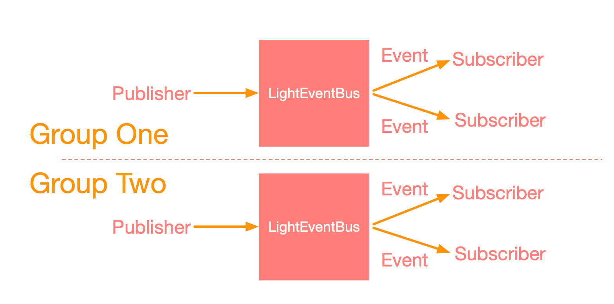

## 轻量级EventBus是什么
轻量级EventBus，即LightEventBus，主要面向业务单元或组件级别的通信框架，提出了分组的概念，具有以下特性:<br>
#### 1.特意设计成不支持异步，以业务单元划分或组件单元划分的常见通信，异步使用极少，而且异步会导致框架变得臃肿，这也就是轻量级的含义
#### 2.支持组件级别的生命周期，也就是不需要在代码中手动注销，只需要通过钩子勾到组件里面，就可以和该组件生命周期一致
#### 3.轻量级EventBus支持两种模式，发布-订阅模式，以及请求-响应模式，其中第二种是EventBus所没有的，另外发布-订阅模式的实现方式也和EventBus不太一样
## 为什么要用轻量级EventBus
1. EventBus面向的是大型业务级别场景，根据业务可以包含多个业务模块，如果多个业务模块接入的消息过多，会导致消息堵塞，举个例子，如果有1000个方法注册了同一个消息，处于同一个队列的情况，需要等前面的方法执行完成才能执行到自己，而方法本身是不知道要等这么长的，跨模块的方式也更会导致管理上的困难。LightEventBus则适合在业务单元或组件内使用，所见即所得，由业务单元或组件内来管理。(EvenBus虽然也支持单独实例化，但如果一个组件生成一个EventBus实例，岂不臃肿)
2. EventBus的注册和注销是配套使用的，并且在注册时，就会遍历对象的所有方法，如果一启动就有非常多的对象需要监听，会严重影响性能，此外不注销会导致内存泄露，但有时注销不是那么方便的。LightEventBus虽然也需要调用注册接口，但真正的方法查找，只有等真正发送消息时才会去遍历，采用的是懒汉方式。另外可以不用调用注销方法，因为本身是和组件同生命周期的
3. EventBus只支持发布-订阅模式，而且一个方法对应一个消息，但是LightEventBus则从另外一种角度来诠释，可以解决方法数限制的问题(方法个数不能超过65535)，且方法调用效率更高(把消息作为Key值，而不是遍历所有方法)，EventBus采用的是遍历方式查找方法，此外LightEventBus还支持请求-响应模式。<br>

## LightEventBus架构简单示意图
<br/>

## LightEventBus使用范例
### 发布-订阅模式
#### 1. 定义分组名称
```java
public static final String GROUP_NAME = "demo";
```
#### 2. 定义消息类型
```java
public static final String EVENT_SHOW_TOAST = "lightbus://request/show_toast";
public static final String EVENT_SAY_HELLO = "lightbus://request/say_hello";
```
#### 3. 注册监听
```
/**
 ** 这里很重要，定义钩子，和该对象生命周期一致，一个业务单元或组件基本只需一个钩子，
 ** 如果没有该钩子，则可能随时被销毁
 */
@Hook
private IEventBus mEventBus;

EventBusFac.getInstance(GROUP_NAME).register(this).hook(this);
```
#### 4. 注册事件
可以监听一个事件或多个事件

```java
@Subscriber(eventType = {EVENT_SHOW_TOAST, EVENT_SAY_HELLO})
public void handleEvent(Event event) {
	String type = event.type;
	Map<String, Object> data = (Map<String, Object>)event.data;
	switch (type){
		case EVENT_SHOW_TOAST:{
			.....
			break;
		}
		case EVENT_SAY_HELLO:{
			.....
			break;
		}
	}
}
```

#### 5. 发送事件
```java
Map<String, Object> data = new HashMap<>();
data.put("msg", "HaHaHa");
Event event = new Event(EVENT_SHOW_TOAST);
//event的data属性可以附带任意类型的参数，只要协商好即可
event.data = data;
EventBusFac.getInstance(GROUP_NAME).postEvent(event);
```
### 请求-响应模式
#### 1. 定义分组名称
```java
public static final String GROUP_NAME = "demo";
```
#### 2. 定义消息类型
```java
public static final String EVENT_GET_MSG = "lightbus://request/get_msg";
```
#### 3. 注册监听
```
/**
 ** 这里很重要，定义钩子，和该对象生命周期一致，一个业务单元或组件基本只需一个钩子，
 ** 如果没有该钩子，则可能随时被销毁
 */
@Hook
private IEventBus mEventBus;

EventBusFac.getInstance(GROUP_NAME).register(this).hook(this);
```
#### 4. 注册事件
可以由多个方法来响应事件

```java
/**第一个方法响应*/
@Subscriber(eventType = EVENT_GET_MSG)
public void requestMsgOne(Event event) {
	Map<String, Object> data;
	if(event.data == null) {
		event.data = new HashMap<String, Object>();
	}
	data = (Map<String, Object>) event.data;
	data.put("key1", "Hello");
	
	EventBusFac.getInstance(GROUP_NAME).response(event, data);
}

/**第二个方法响应*/
@Subscriber(eventType = EVENT_GET_MSG)
public void requestMsgTwo(Event event) {
	Map<String, Object> data;
	if(event.data == null) {
		event.data = new HashMap<String, Object>();
	}
	data = (Map<String, Object>) event.data;
	data.put("key2", "World");
	
	EventBusFac.getInstance(GROUP_NAME).response(event, data);
}
....
```
#### 5. 发送请求
```java
Response response = EventBusFac
                .getInstance(GROUP_NAME)
                .request(new Event(EVENT_GET_MSG));
if(response != null && Response.OK == response.resultCode) {
	Map<String, Object> data = (Map<String, Object>) response.body;
	if(data != null) {
		StringBuilder sb = new StringBuilder();
		sb.append(data.get("key1"));
		sb.append(" ");
		sb.append(data.get("key2"));
		...
	}
}
```

##混淆编译时注意
有可能在混淆编译时，无法正常使用，请将下面规则拷贝过去<br/>

```java
-keep @com.appleye.eventbus.NoProguard class *{
    <fields>;
    <methods>;
}

-keep,allowobfuscation @interface com.appleye.eventbus.NoProguard

-keepclassmembers class * {
    com.appleye.eventbus.NoProguard *;
}

-keepclassmembers class ** {
    @com.appleye.eventbus.Subscriber <methods>;
}

-keepclassmembers class ** {
    @com.appleye.eventbus.Hook <fields>;
}
